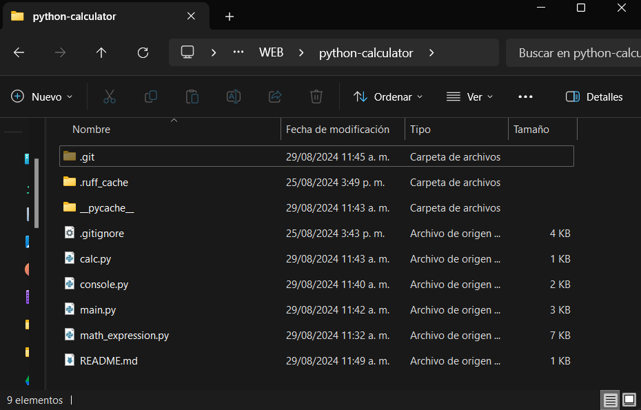
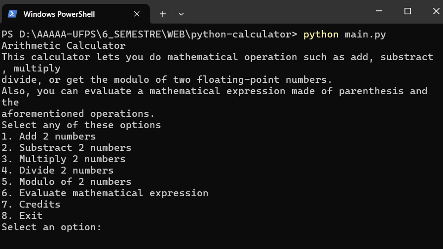
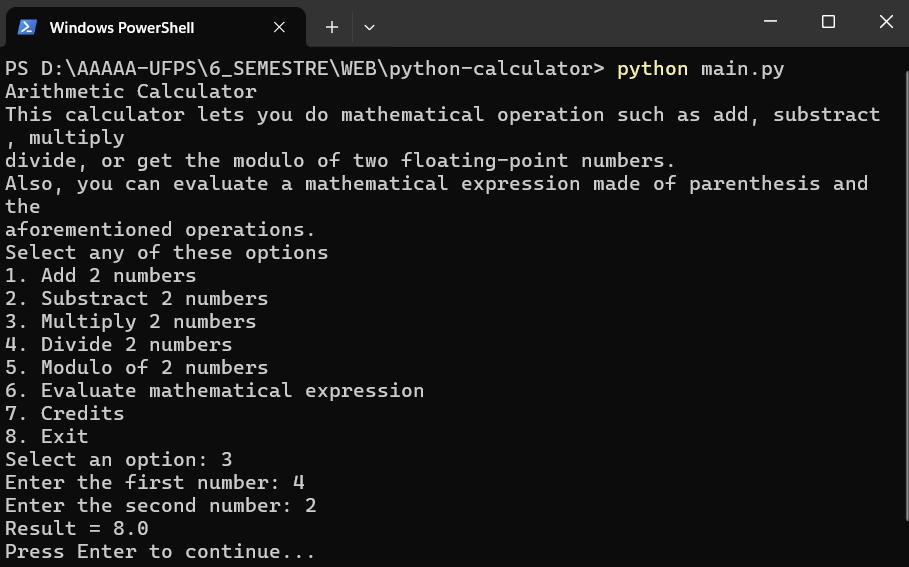
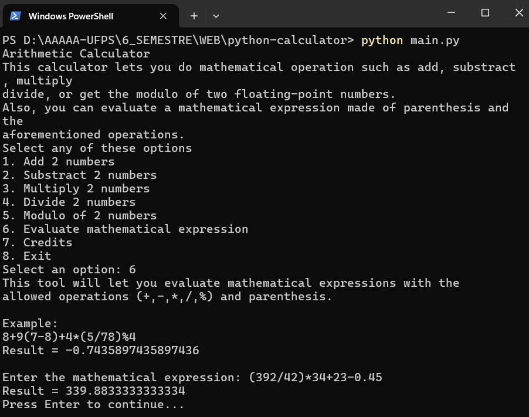

# python-calculator
Python Arithmetic Calculator for Web Programming Course Group C 2024 - II

This Arithmetic Calculator can make operations such as adding, substractig, multiplying, dividing and getting the modulo of 2 floating-point numbers.

As an adittion, it comes with an useful tool for evaluating mathematical expressions made of the aforementioned operations and parenthesis. It uses the infix to postfix algorithm.

## Team members:
 - 1152255 Jorge Andres Marles Florez
 - 1152250 Karen Lizeth Quintero Villasmil
 - 1151752 Kevin Jackson Ortega Bonfante

## Pre-requisites
Python 3.12.5

## How to Use
1. Download / clone the repository

2. In the source code folder, start a command prompt

3. Write the following command:
`python main.py`

4. Select some option by writing the option number.

5. For the mathematical expression, write it as mentioned in the example
